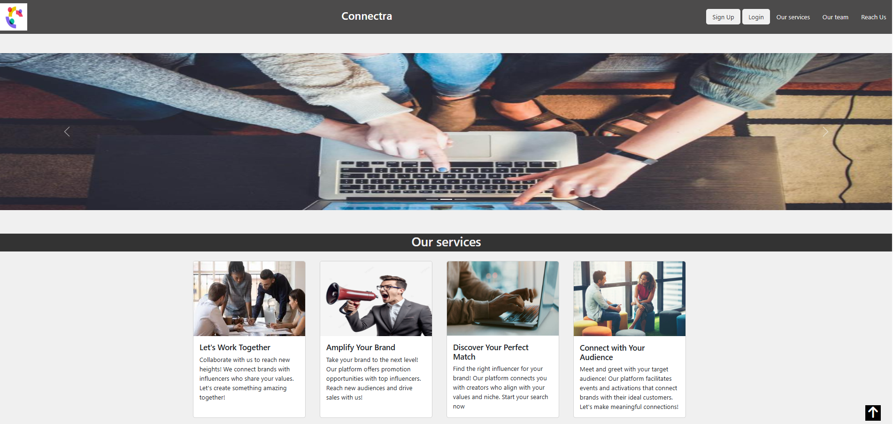
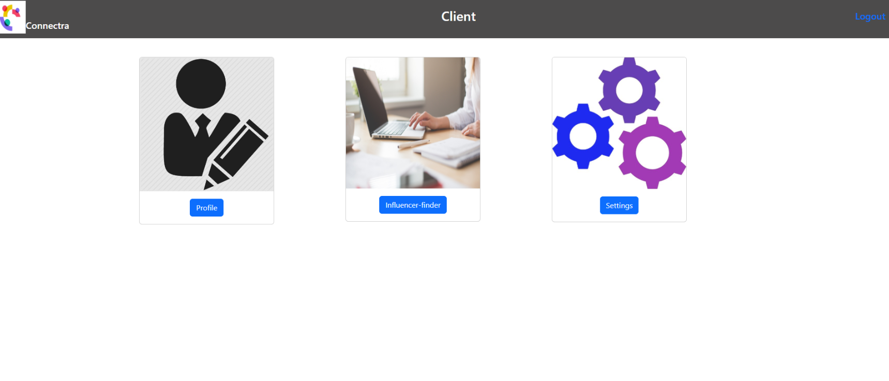

# Connectra

## Project Overview

Connectra is a role-based full-stack web application designed to connect influencers with clients (brands, event organizers, or individuals) for digital collaborations, promotions, and event marketing.

The platform simplifies the process of discovering influencers and enables smooth collaboration between both parties through structured profiles and search features.

---

## User Roles

Connectra supports two types of users:

### Influencer
Influencers can showcase their expertise, social presence, and availability for collaborations.

### Client
Clients can search, discover, and connect with suitable influencers for promotions and partnerships.

---

## How Influencers and Clients Connect

1. A user signs up and selects a role (Influencer or Client).
2. Influencers create and update their profile with domains, city, and social media links.
3. Influencers post their availability or upcoming events.
4. Clients search for influencers by field, city, or name.
5. Clients view influencer profiles and reach out via social links or contact details.
6. Influencers and clients collaborate externally for promotions or events.

---

## Features

### Authentication
- Role-based signup (Influencer / Client)
- Secure login and logout
- Password recovery option

### Influencer Features
- Create and update profile
- Select multiple domains of expertise
- Add Instagram, Facebook, and YouTube links
- Post availability or upcoming events
- Manage and delete posted events
- Change account password

### Client Features
- Create and update profile
- Search influencers by field, city, or name
- View influencer profiles
- Connect with influencers for collaborations
- Change account password

---

## Tech Stack

- Frontend: HTML, CSS, JavaScript, Bootstrap
- Backend: Node.js
- Database: MySQL 
- Hosting: Render

---

## Screenshots

```markdown




```

---

## 🛠️ Installation

```bash
git clone https://github.com/tnishagarg/Connectra.git
cd Connectra
npm install
npm start
```

---

## 🌐 Live Demo

https://connectra-qg8r.onrender.com

---

## 👩‍💻 Author

**Tnisha Garg**  
B.Tech Computer Engineering, Thapar University

---

## 📄 License

This project is developed for educational purposes.
